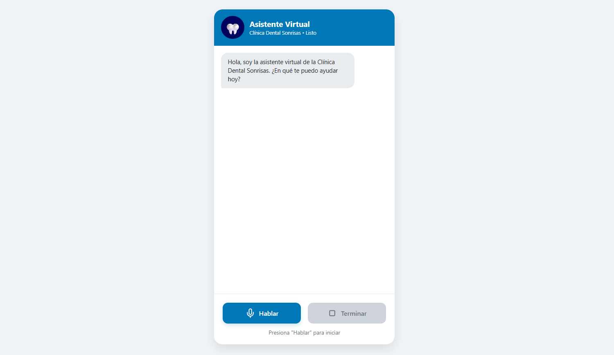
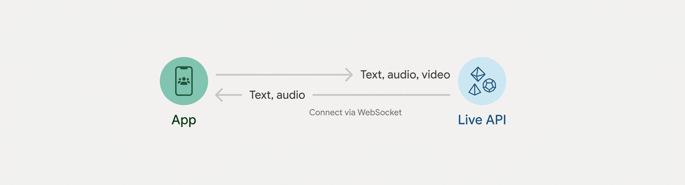

# Asistente_Digital_De_Clinica_Dental
Chat de voz diseñado para automatizar la atención a pacientes de Clínicas Dentales. Este asistente puede trabajar las 24 horas del día para garantizar una comunicación fluida y reducir la carga administrativa del personal.

__¿Que puede hacer este proyecto?__ 
* Brindar Información de la Clínica
* Métodos de Pago y Facturación
* Atención Pediátrica
* Ofrecer Servicios y Precios
* Descripción de Tratamientos
* Agendar Citas (Al correo personal seleccionado)
* Cancelar Citas (En el correo personal seleccionado)
* Manejar de Situaciones Críticas (Dar una recomendación)

Todos los datos brindados anteriormente pueden ser modificados según las necesidades en la ruta __Backend/server.js__ linea 21 a la 68.

> [!CAUTION]
> La Api gratuita de Gemini utiliza las conversaciones para entrenar sus modelos, si se trabajará con información real se recomienda la versión de paga porque cuenta con protección de datos de nivel empresarial.

# Configurar dependencias e inicializar el servidor
Abre la terminal en la raíz del proyecto, navega a la carpeta Backend y ejecuta los siguientes comandos para instalar los paquetes necesarios (@google/genai para Gemini, googleapis para Calendar, express, dotenv y cors):
* cd Backend
* npm init -y
* npm install express dotenv cors googleapis @google/genai

Abre el archivo Backend/package.json en tu editor.
Cambia la línea "type": "commonjs" por: 

* "type": "module"

Guarda el archivo.

# Crear una variable de entorno .env
En la raíz de la carpeta Backend crear un archivo con el nombre: **.env** Luego ubicarse en Backend/.env y escribir:
* PORT=3000
* GEMINI_API_KEY=Aquí_colocar_tu_api_key_de_gemini
* GOOGLE_CALENDAR_CREDENTIALS=credentials.json
* CALENDAR_ID=primary

# APIs necesarias (Google Cloud / Calendar y Gemini)
Paso 1: Obtener la API Key gratuita de Gemini
* Entra a [Google AI Studio](https://aistudio.google.com/)
* Inicia sesión con tu cuenta de Google.
* Haz clic en Get API key y luego en Create API key.
* Copia la clave generada y pégala en tu archivo Backend/.env:
* GEMINI_API_KEY=Aquí_colocar_tu_api_key_de_gemini

Paso 2: Crear el proyecto y habilitar Google Calendar en Google Cloud
* Ve a la [Consola de Google Cloud](https://console.cloud.google.com/).
* Abre el selector de Proyectos "Ctrl+o" (por ejemplo: Clinica-Dental-Voicebot).
* En el menú lateral, ve a APIs y servicios > Biblioteca.
* Busca Google Calendar API y haz clic en Habilitar.

Paso 3: Crear la Cuenta de Servicio (Service Account) y descargar credenciales
* En la consola de Google Cloud, ve a APIs y servicios > Credenciales.
* Haz clic en Crear credenciales y selecciona Cuenta de servicio.
* Ponle un nombre (ej. calendar-bot) y presiona Crear y continuar > Listo.
* Haz clic sobre la cuenta de servicio recién creada, ve a la pestaña Claves (Keys).
* Haz clic en Agregar clave > Crear clave nueva > Selecciona JSON y descarga el archivo.
* Renombra ese archivo descargado como "credentials.json" y muévelo dentro de tu carpeta Backend/.

Paso 4: Compartir tu calendario de Google con la cuenta de servicio
* Abre el archivo "credentials.json" y copia la dirección que está en el campo "client_email" (tiene un formato parecido a calendar-bot@tu-proyecto.iam.gserviceaccount.com).
* Ve a [Google Calendar](https://calendar.google.com/).
* En la columna izquierda, busca el calendario que usarás (o usa tu calendario principal), pasa el cursor sobre él, haz clic en los 3 puntos y selecciona Configuración y privacidad.
* Ve a la sección Compartir con determinadas personas o grupos y haz clic en Añadir personas.
* Pega el correo de la cuenta de servicio que copiaste y asígnale el permiso Realizar cambios y gestionar el uso compartido.
* Copia el ID del calendario (se encuentra más abajo en esa misma página de configuración; si es tu calendario principal, la ID suele ser tu correo personal o primary).
* Actualiza tu archivo Backend/.env:
* CALENDAR_ID=Aquí_tu_id_de_calendario@group.calendar.google.com 

# ¿Por qué usar un Modelo de Texto de Salida?
1. **Comprensión del Lenguaje Natural (NLU) e Intención:**  
Analiza el texto transcrito para entender qué desea realmente el usuario y extrae datos clave como fechas, horas o servicios.

2. **Razonamiento y Toma de Decisiones (Function Calling):**  
Evalúa la consulta en tiempo real y decide cuándo ejecutar las funciones de Google Calendar para verificar disponibilidad o agendar.

3. **Aplicación de Reglas de Negocio (`SYSTEM_INSTRUCTION`):**  
Garantiza que la respuesta cumpla con las políticas de la clínica, como limitar a una cita por día y usar respuestas cortas sin Markdown.

4. **Generación de Respuestas Fluidas y Coherentes:**  
Redacta respuestas claras y naturales combinando el historial de la charla, la información de la clínica y las confirmaciones del calendario.

# ¿Cómo funciona la API de Gemini?
La API de Gemini actúa como un servicio capaz de procesar interacción multimodal mediante HTTP/HTTPS seguro en formato JSON.

* **Cómo funciona:** La aplicación (App) envía peticiones de texto, audio o video a la API (o Live API) para que el modelo procese el contexto, aplique reglas y devuelva respuestas en tiempo real.

* **Qué se le puede enviar (Input):**
  * **Texto, audio y video:** Datos multimodales enviados desde la aplicación cliente hacia la API de Gemini.
  * **System Instruction:** Reglas de comportamiento, rol y restricciones del asistente.
  * **Tools (Function Calling):** Declaraciones de funciones (como la gestión de Google Calendar) para que el modelo decida cuándo ejecutarlas.

* **Qué recibe (Output):**
  * **Texto y audio:** Respuestas generadas por la API en formato de texto o flujo de audio procesado para el usuario.
  * **Llamadas a funciones (Function Calls):** Parámetros e instrucciones extraídas para ejecutarse en el servidor o cliente.
  * **Metadatos:** Información del consumo de tokens y estado del procesamiento.

* **Protocolo que usa:**
  * **WebSocket (Connect via WebSocket):** Utilizado por la Live API para mantener un canal bidireccional de baja latencia en transmisiones de audio, video y texto en tiempo real.
  * **HTTPS / REST:** Para peticiones estándar `POST` en formato `JSON` mediante `generateContent`.
  

# Ejecutar el Servidor del Backend
Para que la interfaz ejecute las instrucciones se debe de inicializar el servidor. En el cmd ubicarse en la ruta __Backend/server.js__ y ejecutar el comando:
>node server.js

Opcional podemos verificar que el Backend responde correctamente con este comando:
>curl -X POST http://localhost:3000/api/chat -H "Content-Type: application/json" -d "{\"message\": \"¿Qué servicios ofrecen y cuáles son sus precios?\"}"

# Errores Comunes en Backend

* **404 Not Found (No Encontrado):**  
Indica que el servidor no pudo encontrar el recurso solicitado, ya sea porque la ruta URL de la API es incorrecta o el elemento buscado no existe.

* **429 Too Many Requests (Demasiadas Solicitudes):**  
Ocurre cuando la aplicación ha enviado demasiadas peticiones en un periodo corto de tiempo, superando los límites de velocidad o la cuota permitida de la API.

* **503 Service Unavailable (Servicio No Disponible):**  
Señala que el servidor o servicio externo no está listo para procesar la solicitud debido a una sobrecarga temporal o a labores de mantenimiento.

# Ejecutar el Servidor del Frontend
No es obligatorio pero se puede levantar un servidor de archivos estático ligero usando __npx__

* Abre una nueva terminal. 
* Navega en la carpeta del proyecto y ubicarse en la ruta __/Fronted__
* Ejecutar el sigiente comando para levantar un servidor web al instante:
> npx serve .

* Te mostrará una URL local normalmente http://localhost:3000 o http://localhost:5000 
* Abre ese enlace en el navegador. 

> [!NOTE]
> * Algunos navegadores como Brave bloquean el microfono por defecto, se recomienda utilizar Google Chrome para pruebas rápidas.
> * La Api gratuita de Gemini limita las peticiones, tienen una prioridad inferior en la cola de procesamiento.